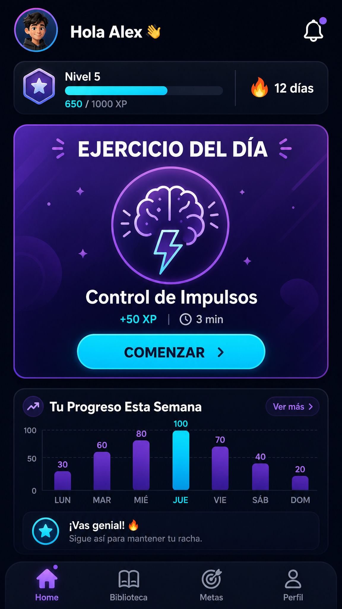
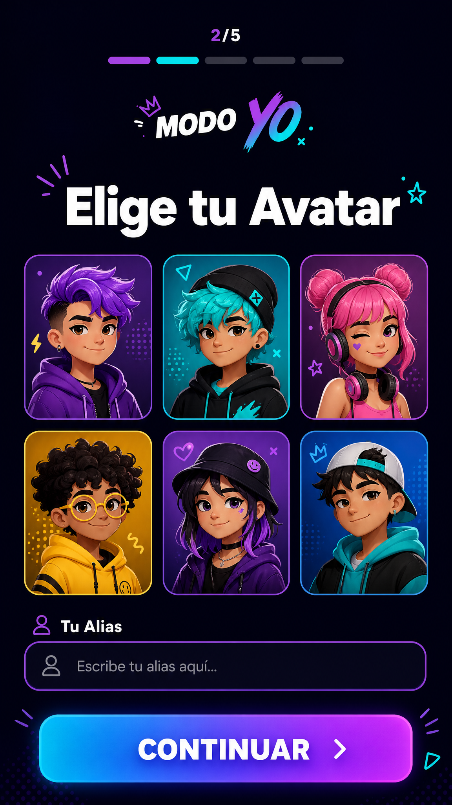
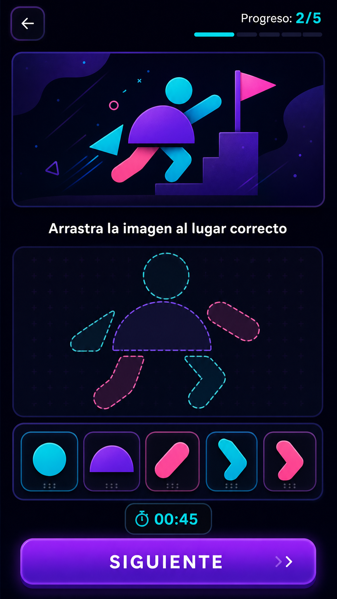
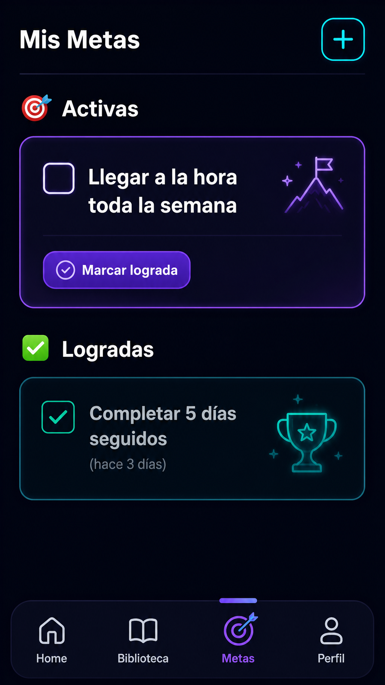
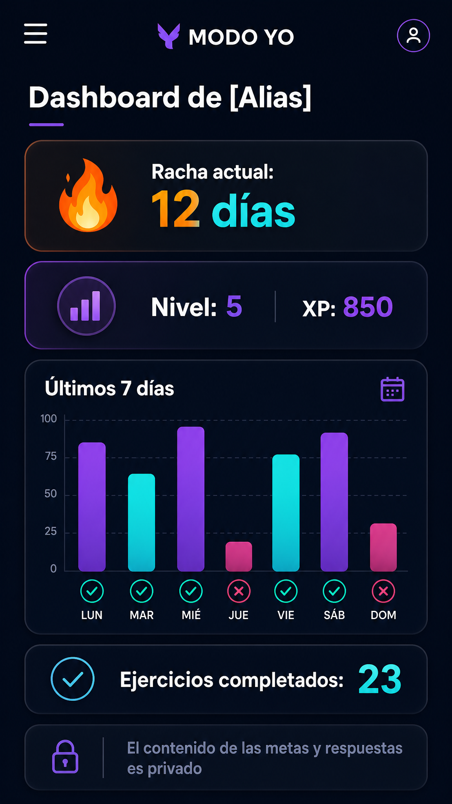
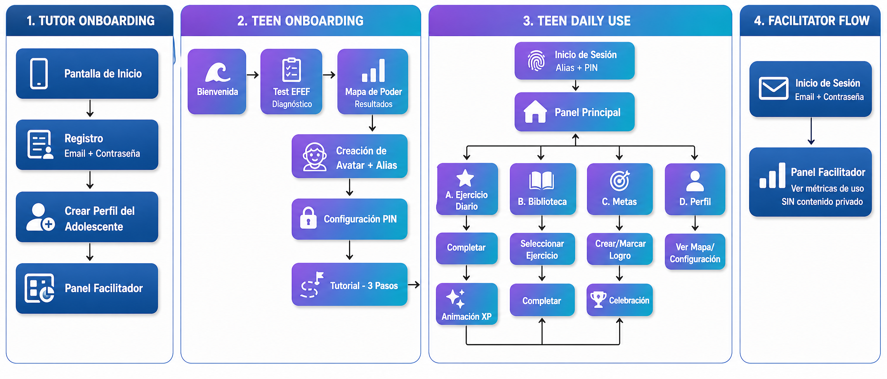

# Wireframes y Maquetas — MODO YO

**Versión:** 1.0  
**Fecha:** 2026-08-02  
**Relacionado:** [ux-specification.md](../ux-specification.md) | Blueprint §10, §11

---

## Descripción

Este directorio contiene los wireframes de alta fidelidad y diagramas de flujo del MVP de MODO YO. Estas maquetas visualizan la especificación UX/UI completa y sirven como referencia para el desarrollo del frontend.

### Principios de Diseño Aplicados
- **Look & Feel:** "Videojuego de productividad" — dark mode con acentos vibrantes
- **Paleta:** Morado/Cyan para acciones del adolescente, Verde para victorias, Azul para facilitador
- **Estilo:** Diseño gamificado, moderno, optimizado para adolescentes (12-18 años)

---

## Wireframes de Pantallas Principales

### 1. Dashboard Principal (Home — Adolescente)

**Componentes clave:**
- Header con avatar, saludo personalizado, nivel y racha
- Hero Card: "Ejercicio del Día" como CTA principal
- Barra de progreso XP visual
- Mini-gráfico de progreso semanal
- Tab bar de navegación inferior

**User Stories:** US-003 (Ejercicio del día), US-009 (Rachas), US-010 (Avatar evolutivo)

---

### 2. Creación de Avatar (Onboarding)

**Componentes clave:**
- Grid de 6 opciones de avatar (género-neutro, ilustrados)
- Campo de texto para Alias
- Indicador de progreso del onboarding (2/5)
- Botón CTA "CONTINUAR"

**User Stories:** US-001 (Perfil y Avatar), US-008 (Onboarding)

---

### 3. Ejercicio Interactivo

**Componentes clave:**
- Header con navegación y progreso del ejercicio
- Ilustración del ejercicio
- Instrucciones claras y concisas
- Área de interacción (drag-and-drop, tap, etc.)
- Timer visual
- Botón de acción "SIGUIENTE"

**User Stories:** US-003 (Entrenamiento interactivo)

---

### 4. Muro de Victorias (Mis Metas)

**Componentes clave:**
- Botón [+] para crear nueva meta
- Sección "Activas" con checkboxes interactivos
- Sección "Logradas" con timestamps
- Diseño que refuerza privacidad (sin acceso del tutor)

**User Stories:** US-004 (Metas personales)

---

### 5. Dashboard del Facilitador

**Componentes clave:**
- Métricas agregadas: racha, nivel, XP
- Gráfico de constancia (últimos 7 días)
- Contador de ejercicios completados
- Banner de privacidad explícito
- Tono de "arquitecto del contexto", no vigilante

**User Stories:** US-005 (Dashboard del facilitador)  
**ADR:** ADR-002 (Privacidad dual)

---

## Diagrama de Flujo del Usuario

### User Journey Completo

**Cubre:**
- **Onboarding del Tutor:** Landing → Registro → Vinculación → Dashboard
- **Onboarding del Adolescente:** Bienvenida → Test EFEF → Mapa de Poder → Avatar → PIN → Tutorial → Dashboard
- **Uso Diario (Adolescente):** Login → Dashboard → (Ejercicios | Biblioteca | Metas | Perfil)
- **Uso del Facilitador:** Login → Ver métricas de constancia

**Código de colores:**
- 🔵 Azul: Flujos del Tutor/Facilitador
- 🟣 Morado/Cyan: Flujos del Adolescente

---

## Notas de Implementación

### Assets Necesarios
- **Avatares:** 6-8 ilustraciones base + 3 niveles de evolución
- **Iconos FE:** 5 iconos únicos para Funciones Ejecutivas
- **Animaciones Lottie:** Celebración de éxito, confetti, subida de nivel
- **Ilustraciones de ejercicios:** 15 para el MVP (3 por cada FE)

### Tecnologías de UI
- **Framework:** React Native + Expo (ADR-005)
- **Estilos:** NativeWind / Tailwind CSS (ADR-008)
- **Componentes:** Atomizados en `/src/components` según el Design System

### Validación
Estas maquetas deben validarse con el usuario principal (Santi, 13 años) antes de implementar para confirmar:
- Claridad de la navegación
- Atractivo visual ("se ve como videojuego, no como tarea")
- Comprensión de las instrucciones

---

## Próximos Pasos

1. **Validar con usuario:** Mostrar wireframes a Santi y recoger feedback
2. **Crear prototipo interactivo:** Figma o prototipo básico en Expo para testear flujos
3. **Iniciar desarrollo:** Implementar componentes siguiendo el Design System de la especificación UX/UI
4. **Testing de usabilidad:** Pruebas con adolescentes durante el desarrollo (Blueprint §15)

---

**Última actualización:** 2026-08-02  
**Responsable:** Equipo MODO YO  
**Versión del Blueprint:** v1.0
